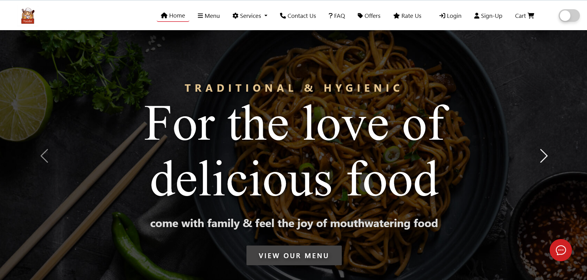
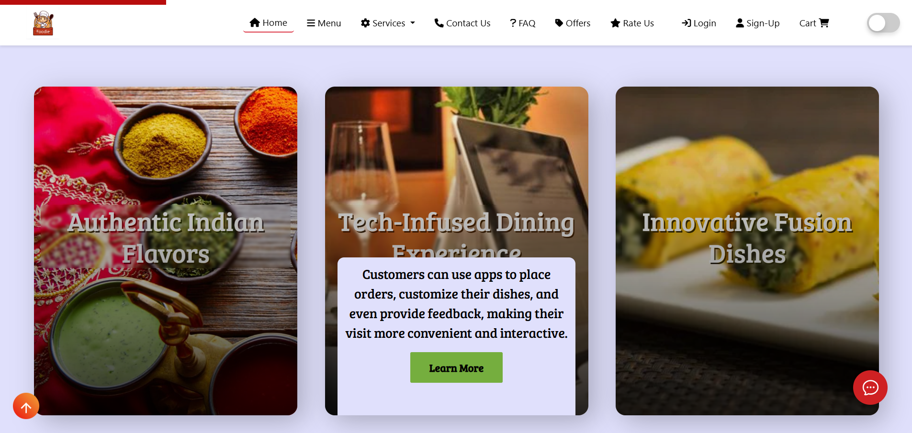
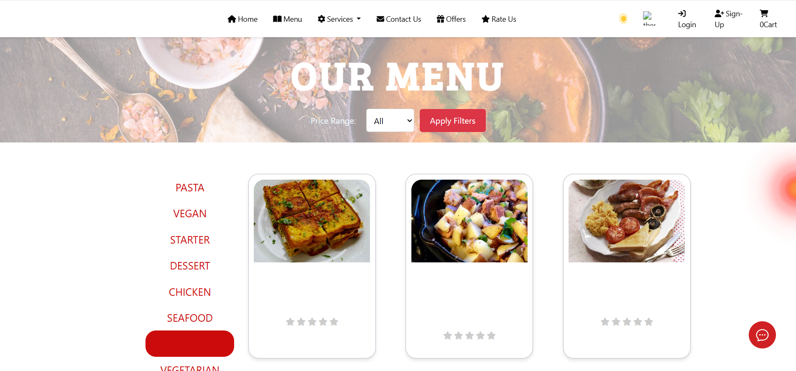
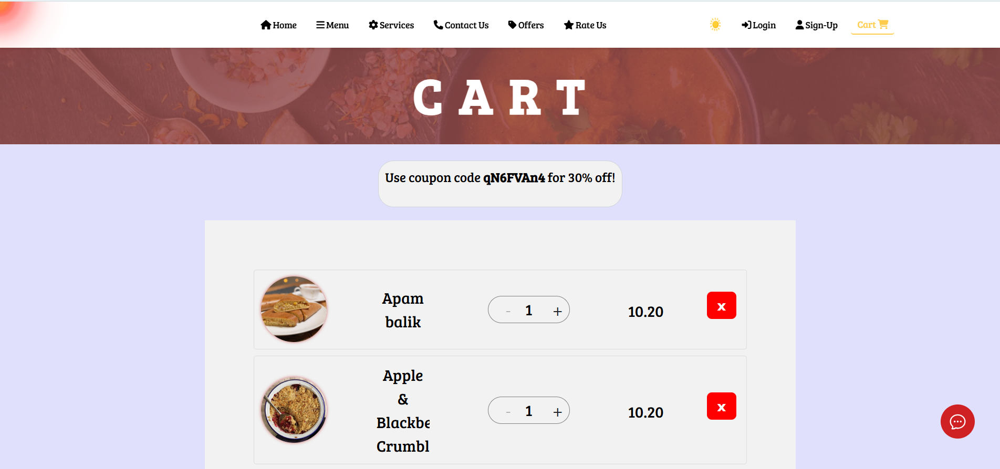
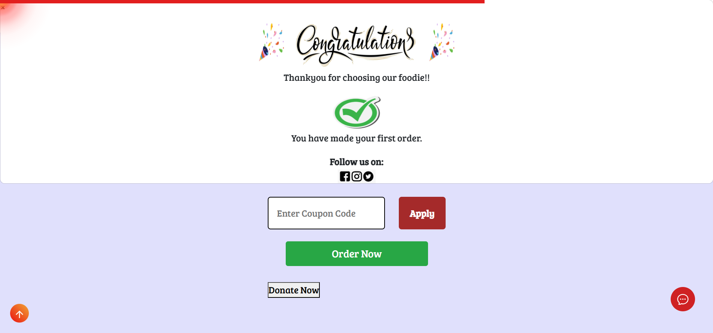

 ## 🍽️ Foodie – Your Campus Food Ordering Companion 🚀

A sleek and intuitive web application that lets students **order food, reserve tables, and enjoy quick pickups** — all within their campus!

Welcome to **Foodie**, your go-to web platform designed for university and college students. Whether you're in a rush between lectures or planning a relaxed meal with friends, **Foodie** makes it simple — ordering, pickup, and table booking, all in one place.

🔗 Live Demo: [Click here to try Foodie!](https://ayushkumar1991.github.io/Foodie_Web_App/)

---

 ✨ Features

 ✅ **Online Ordering** – Browse the menu, select your favorite meals, and place your order in a few clicks.
 🏃‍♂️ **Quick Pickups** – No waiting! Grab your food on the go.
 🍴 **Table Booking** – Reserve tables for group meals or solo dining with ease.
 📋 **Interactive Menu** – Dynamic food menu with images, prices, and delicious details.
 📲 **Mobile App Info** – Access the mobile version and find app-related resources.
 💬 **Contact Page** – For queries, suggestions, and support.
 🖥️ **Fully Responsive** – Works seamlessly on mobiles, tablets, and desktops.

---

## 📸 Screenshots

### 🏠 Home Page



### 🍽️ Menu Page


### 🏠 Cart Page



## ⚙️ Tech Stack

| Tech            | Usage                                  |
|-----------------|----------------------------------------|
| HTML5           | Semantic structure                     |
| CSS3            | Responsive and modern styling          |
| JavaScript      | Interactive behavior                   |
| Bootstrap 5     | UI components and layout               |
| AOS.js          | Animate on Scroll effects              |
| Google Fonts    | Beautiful typography                   |
| Font Awesome    | Crisp and clean icons                  |
| GitHub Pages    | Live deployment platform               |

---

## 🚀 Getting Started

### Prerequisites

- [Git](https://git-scm.com/) installed on your machine
- A modern web browser (Chrome, Firefox, etc.)

### Steps to Run Locally

```bash
git clone https://github.com/ayushkumar1991/Foodie_Web_App.git
cd Foodie_Web_App
---

🤝 Contributing
Contributions are welcome and appreciated! 💖
If you'd like to improve this project:

Fork the repo

Create a feature branch:
git checkout -b feature/AmazingFeature

Commit changes:
git commit -m "Add AmazingFeature"

Push to your forked repo:
git push origin feature/AmazingFeature

Open a Pull Request 🚀

📄 License
This project is licensed under the MIT License.
Feel free to use it, modify it, and share it freely.

📬 Contact
Made with ❤️ by Ayush Kumar
🔗 https://github.com/ayushkumar1991

🧠 “Great food is one tap away — only with Foodie!”
